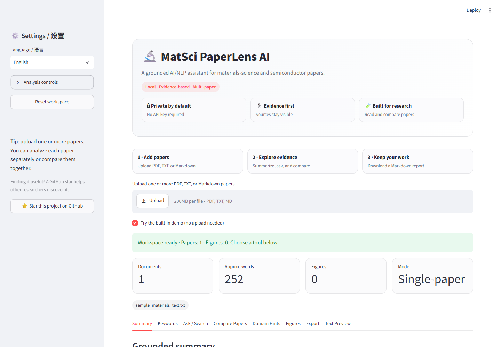

# MatSci PaperLens AI

[](https://mat-sci-paperlens-ai-nesmxsbkrzw5ezrce6z5pu.streamlit.app/)
[](https://github.com/Gardenia-hash/mat-sci-paperlens-ai/actions/workflows/python-tests.yml)


A local-first, evidence-grounded reading assistant for materials-science and semiconductor papers.

MatSci PaperLens AI analyzes uploaded PDF, TXT, and Markdown papers without requiring an API key. It keeps papers separate by default, preserves source names in grounded answers, and makes uncertainty visible instead of inventing unsupported claims.

The interface supports English and Chinese. Chinese mode localizes the UI and analysis labels; it does **not** translate or alter the original evidence text from a paper.

[](https://mat-sci-paperlens-ai-nesmxsbkrzw5ezrce6z5pu.streamlit.app/)

## Current features

- Streamlit web interface with English / Chinese UI
- Built-in interactive demo, three-step onboarding, progress feedback, and one-click workspace reset
- PDF, TXT, and Markdown upload
- PyMuPDF text extraction and scientific-PDF noise cleanup
- PDF hard-wrap reconstruction, scientific-abbreviation protection, and incomplete-fragment filtering
- Section-aware extractive summaries
- Per-paper or explicitly combined keyword extraction
- English or Chinese grounded questions against one selected paper or all papers
- Confidence labels, retrieved evidence passages, and source document names
- Multi-paper comparison across focus, material, fabrication, characterization, parameters, results, and limitations
- Per-paper materials-science domain hints
- Local raster-figure extraction with source page, dimensions, format, and nearby caption
- A dedicated **Figures / 图像解读** tab with explicit paper selection
- Text-grounded figure interpretation separated into **Direct evidence**, **Reasonable inference**, and **Unknown**
- Cached document analysis for smoother Streamlit interactions
- Source-separated Markdown report export
- pytest coverage and GitHub Actions

## Evidence and privacy principles

- Papers are processed separately unless the user explicitly chooses a combined / all-papers mode.
- Evidence from multiple papers is never presented as if it came from one paper.
- The baseline works locally and does not require a paid model or API key.
- Figure interpretation uses the caption and nearby page text only. It does not claim to read plotted values, colors, axes, or visual trends from pixels.
- Automated output is a reading aid, not a replacement for checking the original paper.

## Quick start

### Windows PowerShell

```powershell
git clone https://github.com/Gardenia-hash/mat-sci-paperlens-ai.git
cd mat-sci-paperlens-ai
python -m venv .venv
.\.venv\Scripts\Activate.ps1
python -m pip install -r requirements.txt
python -m pip install -r requirements-dev.txt
python -m pytest -q
python -m streamlit run app.py
```

If PowerShell blocks activation, you can run the virtual-environment interpreter directly:

```powershell
.\.venv\Scripts\python.exe -m pip install -r requirements.txt
.\.venv\Scripts\python.exe -m pip install -r requirements-dev.txt
.\.venv\Scripts\python.exe -m pytest -q
.\.venv\Scripts\python.exe -m streamlit run app.py
```

### macOS / Linux

```bash
git clone https://github.com/Gardenia-hash/mat-sci-paperlens-ai.git
cd mat-sci-paperlens-ai
python -m venv .venv
source .venv/bin/activate
python -m pip install -r requirements.txt
python -m pip install -r requirements-dev.txt
python -m pytest -q
python -m streamlit run app.py
```

Open the local URL printed by Streamlit, normally `http://localhost:8501`.

The built-in materials-science example is enabled on first launch, so the interface can be explored before uploading a paper. Uploading a real file automatically switches the demo off.

## Live demo

Open the public app at [mat-sci-paperlens-ai-nesmxsbkrzw5ezrce6z5pu.streamlit.app](https://mat-sci-paperlens-ai-nesmxsbkrzw5ezrce6z5pu.streamlit.app/). No account, API key, or local installation is required.

The deployment uses pinned production dependencies, bounded caches, upload guardrails, a consistent theme, and a CI health check. See [DEPLOYMENT.md](DEPLOYMENT.md) for deployment coordinates and maintenance instructions.

## Using the Figures tab

1. Upload one or more PDF papers.
2. Open **Figures / 图像解读**.
3. When multiple papers are loaded, select the source paper first.
4. Select an extracted figure and inspect its source page and original caption.
5. Read the system interpretation by evidence level.

The current extractor targets embedded raster images. Vector-only figures, scanned full-page PDFs, images below the noise threshold, and captions with unusual layouts may not be detected. In those cases the app shows an explicit empty-state message.

## Project structure

```text
mat-sci-paperlens-ai/
├── app.py
├── DEPLOYMENT.md
├── requirements.txt
├── requirements-dev.txt
├── README.md
├── .streamlit/
│   └── config.toml
├── src/
│   ├── figure_utils.py
│   ├── document_utils.py
│   ├── models.py
│   ├── nlp_pipeline.py
│   ├── pdf_utils.py
│   ├── report_utils.py
│   └── text_utils.py
├── data/
│   └── sample_materials_text.txt
├── tests/
│   ├── test_figure_utils.py
│   └── test_nlp_pipeline.py
├── scripts/
│   └── smoke_streamlit.py
└── .github/workflows/python-tests.yml
```

## How it works

- **Summaries:** hard-wrapped PDF lines are rebuilt into complete sentences, then selected evidence is ordered into a readable extractive overview
- **Keywords:** unigram / bigram TF-IDF features
- **Grounded QA:** sentence-safe passage retrieval, scored intent detection, relevance filtering, source isolation, and document-order integration
- **Comparison:** complete evidence sentences are selected independently per paper and restored to document order
- **Figures:** PyMuPDF embedded-image extraction, page-aware metadata, spatially nearest caption association, and text-only interpretation

## Roadmap

- [x] Multi-paper comparison and explicit all-papers modes
- [x] English / Chinese interface
- [x] Raster figure, page, and caption extraction
- [x] Grounded text-only figure interpretation
- [x] Complete-sentence reconstruction and integrated extractive output
- [x] First-run onboarding, processing feedback, caching, and Markdown report export
- [x] Streamlit Community Cloud configuration and deployment health check
- [ ] Page-aware evidence citations for Summary / QA / Compare
- [ ] Better multi-column and wrapped-caption association
- [ ] OCR support for scanned PDFs
- [ ] Optional visual-model provider behind an explicit configuration switch
- [ ] Optional Sentence Transformers with TF-IDF fallback
- [ ] DOI / title / author metadata extraction
- [ ] CSV report export
- [ ] UI smoke tests and example screenshots

## Development checks

```powershell
python -m pytest -q
python -m streamlit run app.py
```

New logic should include tests. Do not commit uploaded PDFs, virtual environments, caches, secrets, or API keys.

## Disclaimer

This tool performs automated text and PDF analysis. Always verify extracted evidence and interpretations against the original paper before academic or engineering use.

## Support the project

If MatSci PaperLens AI is useful to your research or learning, consider starring the repository. Stars help other materials-science researchers discover the project and give clear feedback that continued development is worthwhile.
